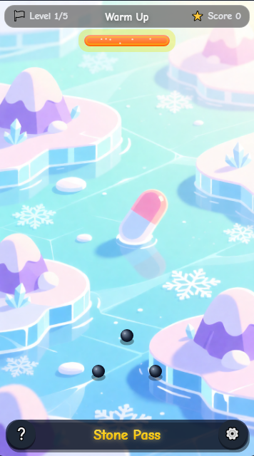

# 🪨 Stone Pass
## 📸 Screenshot



**Stone Pass** is a minimalist, skill-based mobile game where precision, timing, and strategy matter.  
Instead of throwing stones, players *tap and strike* stones to guide them through narrow gates and challenging paths.

Designed with a clean visual style and smooth physics, **Stone Pass** delivers a satisfying arcade experience inspired by classic precision games.

---

## 🎮 Gameplay Overview

- You control **three stones** on the field.
- Tap near a stone to **strike it**, not throw it.
- Your goal is to pass the moving stone **between the other two stones**.
- After a successful pass, guide the stone through the **gate at the top**.
- Each level increases difficulty with tighter gates, friction changes, and obstacles.

One wrong move — and it’s game over.

---

## 🧠 Game Rules

- Stones must pass **cleanly between the other two stones** before reaching the gate.
- Hitting another stone, an obstacle, or leaving the screen results in **failure**.
- Stones slow down due to **friction** — plan your strike carefully.
- Some levels include **moving or dangerous obstacles**.
- Precision matters more than speed.

---

## ✨ Features

- 🎯 Precision-based stone striking mechanics  
- 🌀 Smooth physics with dynamic friction  
- 🚪 Glowing animated gates  
- 💥 Visual effects and soft mobile-style shadows  
- 🎵 Sound effects and background music  
- 📱 Mobile-friendly canvas-based rendering  
- 🧪 Test mode for development and tuning  

---

## 🧩 Levels

1. **Warm Up** – Learn the basics  
2. **Narrow Pass** – Tighter spacing  
3. **Friction** – Momentum control  
4. **Precision** – Perfect timing required  
5. **Inferno** – Obstacles and danger  

---

## 🛠️ Tech Stack

- React + TypeScript
- HTML5 Canvas
- Custom physics & rendering loop
- No external game engine
- Fully client-side

---

## ▶️ Running the Project

```bash
npm install
npm run dev
